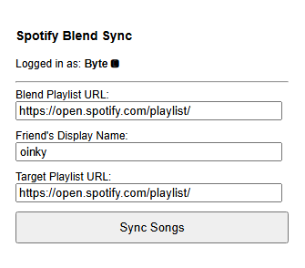

# Spotify Blend Sync

A browser extension to automatically sync songs added by a specific friend from a Spotify Blend playlist to a new or existing playlist.

---

## The Problem
Spotify Blends are a fantastic way to discover music with friends, but there's no built-in feature to isolate and save *only* the songs your friend contributes. If you want to create a playlist of just their recommendations from a Blend, you have to do it manually, song by song.

This extension automates that entire process.

## Features
- **Selective Syncing:** Identifies and syncs only the songs added by a specified friend in a Blend.
- **Spotify Authentication:** Securely logs into your Spotify account to manage playlists.
- **Duplicate Prevention:** Checks the target playlist to ensure it only adds new songs, preventing duplicates.
- **Persistent Inputs:** Remembers your previously used playlist URLs and friend's name for convenience.

## How It Works
This extension uses an advanced technique to access data not available through the public Spotify API.

1.  **Fetch Interception:** A script (`interceptor.js`) is injected directly into the Spotify web player's page. This script wraps the browser's native `fetch` function, allowing it to "listen in" on the private API calls the official web app makes.

2.  **Passive Credential Sniffing:** When the Spotify app makes a request to its internal API (`/pathfinder/v2/query`), our interceptor captures two crucial pieces of information:
    *   The temporary **internal authorization token** (Bearer Token) from the request headers.
    *   The unique **SHA-256 hash** for the specific operation (e.g., `fetchPlaylist`) from the request body.

3.  **Proxied API Call:** The extension then uses these captured, known-good credentials to make its own request to the private API, asking for the detailed data of the Blend playlist. This data includes the "multi-user attribution" metadata, which tells us who added each song.

4.  **Public API for Syncing:** After filtering the songs, the extension uses the standard, public Spotify API (with the user's permission) to add the new tracks to the target playlist.

This hybrid approach allows the extension to read private data while writing to playlists in a safe and authorized manner.

## Setup and Installation
Because this extension uses the Spotify API, a one-time setup is required to get your own API credentials.

1.  **Download:** Clone or download this repository to your local machine.

2.  **Load the Extension:**
    *   Open Google Chrome and navigate to `chrome://extensions`.
    *   Turn on **"Developer mode"** in the top-right corner.
    *   Click **"Load unpacked"** and select the folder where you saved this project.

3.  **Configure Spotify Credentials:**
    *   The extension's popup will automatically open the settings page on first run.
    *   Go to the [Spotify Developer Dashboard](https://developer.spotify.com/dashboard) and log in.
    *   Click **"Create App"**. Give it any name and description (e.g., "Blend Sync").
    *   You will see your **Client ID**. Copy this.
    *   Paste the **Client ID** into the extension's settings page.
    *   Now, on the Spotify dashboard, click **"Edit Settings"**.
    *   Go back to the extension's settings page. It will display a unique **Redirect URI** for you (e.g., `https://<your-extension-id>.chromiumapp.org/`). Copy this URI.
    *   Paste the Redirect URI into the "Redirect URIs" box on the Spotify dashboard and click **"Add"**, then **"Save"**.
    *   Finally, click **"Save and Continue"** in the extension's settings.

## Usage
1.  After setup, the popup will prompt you to **Login with Spotify**. This will open a window to authorize the extension.
2.  **Prime the Interceptor:** Before your first sync, navigate around the Spotify web app for a moment. **Crucially, click on at least one playlist** (it can be any playlist). This ensures the interceptor has captured the necessary credentials.
3.  **Fill in the Details:**
    *   Paste the URL of your **Blend Playlist**.
    *   Enter your friend's **exact Spotify display name**.
    *   Paste the URL of the **Target Playlist** where you want the songs to go.
4.  Click **"Sync Songs"** and wait for the success message!

## Disclaimer
This extension relies on intercepting Spotify's private web API. Spotify can change this API at any time without warning, which may break the extension's core functionality. This tool is provided as-is for personal use.